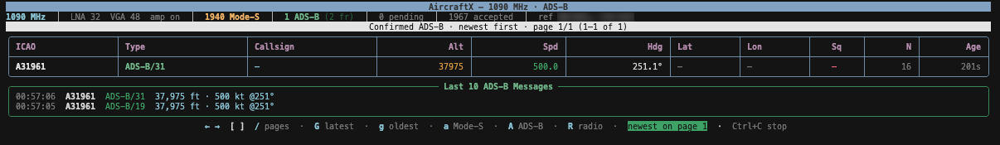
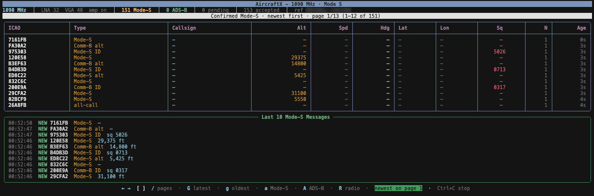
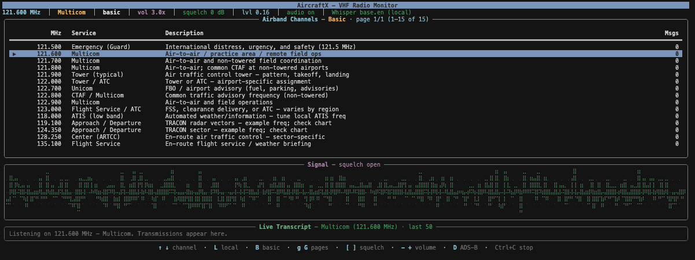

# AircraftX

**AircraftX** is a terminal-based ADS-B and Mode S receiver for the [HackRF One](https://greatscottgadgets.com/hackrf/one/) on macOS. It captures 1090 MHz traffic, demodulates Pulse Position Modulation (PPM) from IQ samples, decodes transponder messages with [pyModeS](https://github.com/junzis/pyModeS), and displays a live dashboard of confirmed aircraft with callsign, altitude, speed, heading, and position when available.

```
   _   _                     __ _  __  __
  /_\ (_)_ __ ___ _ __ __ _ / _| |_\ \/ /
 //_\\| | '__/ __| '__/ _` | |_| __|\  / 
/  _  \ | | | (__| | | (_| |  _| |_ /  \ 
\_/ \_/_|_|  \___|_|  \__,_|_|  \__/_/\_\
```

## Features

- Live capture from HackRF at 1090 MHz / 2 MS/s
- Software PPM demodulator with preamble correlation and phase correction
- ADS-B (DF17/18) decoding with CPR position pairing via pyModeS
- Anti-spam confirmation: aircraft must repeat before appearing in the table
- Rich live dashboard with paginated aircraft table (12 per page) and last-5-message feed
- macOS discovery sound when a new aircraft is confirmed
- **VHF radio monitor dashboard** — tune common airband channels, live local transcription (optional `faster-whisper`)
- JSON config at `~/.config/aircraftx/config.json` (auto-created on first run)
- IQ file replay for offline testing
- Indoor and outdoor sensitivity presets
- Local airport frequency lookup from OurAirports (when `lat`/`lon` are set)

## Screenshots

Examples from a live HackRF session (macOS terminal, Rich UI):

### ADS-B dashboard

Confirmed aircraft table with altitude, speed, heading, and a scrolling message feed. Press **`A`** to return here from Mode S or radio mode.



### Mode S dashboard

Mode S transponder replies (altitude, squawk, all-call) with paginated table and last-10 message log. Press **`a`** from the ADS-B view.



### VHF radio monitor

Airband channel list (**Local** or **Basic**), braille signal scope, live transcript, squelch/volume controls, and speaker audio. Press **`R`** from ADS-B to enter; **`D`** to return.



## Requirements

### Hardware

- HackRF One (USB)
- 1090 MHz antenna (tuned ADS-B antenna strongly recommended; a generic wire works poorly)
- macOS host

### Software

- Python 3.11+
- [Homebrew](https://brew.sh/) `hackrf` tools (`hackrf_transfer`)

```bash
brew install hackrf
```

## Quick start

Clone the repo and run directly from source — no `pip install` required:

```bash
git clone <repo-url> adsb && cd adsb
make dev-install
./start.sh
```

`start.sh` sets `PYTHONPATH` to the project root and runs `python -m aircraftx`. On first launch, AircraftX writes default settings to `~/.config/aircraftx/config.json`.

### Installed CLI

To install the `aircraftx` command into your virtualenv:

```bash
make install
aircraftx
```

Or from PyPI (after publishing):

```bash
pip install aircraftx
aircraftx
```

## Configuration

Settings live in **`~/.config/aircraftx/config.json`**. The file is created automatically on first run. Edit it to set your defaults; CLI flags always override config values for that session.

| Key | Type | Default | Description |
|-----|------|---------|-------------|
| `lat` | float \| null | `null` | Your latitude; helps decode CPR position from a single frame |
| `lon` | float \| null | `null` | Your longitude |
| `indoor` | bool | `true` | Relaxed demod threshold and 2-hit confirmation |
| `lna` | int | `32` | HackRF LNA gain (0–40 dB) |
| `vga` | int | `48` | HackRF VGA gain (0–62 dB) |
| `amp_enable` | bool | `true` | HackRF onboard RF amplifier (+11 dB) |
| `sound_enabled` | bool | `true` | Play macOS ping on the first ADS-B frame from a new aircraft |
| `refresh_hz` | float | `2.0` | Dashboard refresh rate |
| `show_banner` | bool | `true` | Print ASCII banner on startup |
| `replay_file` | string \| null | `null` | Path to raw IQ capture for offline replay |
| `radio_channels` | array | built-in list | Editable preset airband channels (`id`, `name`, `freq_mhz`, `description`) |
| `radio_local_lookup` | bool | `true` | Fetch nearby airport frequencies from [OurAirports](https://ourairports.com/data/) using `lat`/`lon` |
| `radio_local_radius_km` | float | `80` | Search radius for local airport lookup |
| `radio_local_max_airports` | int | `8` | Max nearby airports in the **Local** channel list |

Example config for outdoor listening near NYC:

```json
{
  "amp_enable": true,
  "indoor": false,
  "lat": 40.450809,
  "lon": -74.132874,
  "lna": 24,
  "refresh_hz": 2.0,
  "replay_file": null,
  "show_banner": true,
  "sound_enabled": true,
  "vga": 40
}
```

Use a custom config path:

```bash
aircraftx --config ~/my-aircraftx.json
```

## CLI reference

```
aircraftx [--config PATH] [options]
```

| Option | Description |
|--------|-------------|
| `--config PATH` | Config file (default: `~/.config/aircraftx/config.json`) |
| `--file PATH` | Replay raw HackRF IQ (int8 I/Q interleaved) instead of live RX |
| `--lat`, `--lon` | Reference position for CPR decode |
| `--indoor` / `--outdoor` | Sensitivity preset |
| `--adsb-only` / `--all-mode-s` | Start on ADS-B table (default) vs Mode-S table — both counts always on status bar; **`A`** / **`a`** toggles table |
| `--lna`, `--vga` | HackRF gain |
| `--amp` / `--no-amp` | RF amplifier |
| `--sound` / `--no-sound` | Discovery notification |
| `--refresh HZ` | UI refresh rate |
| `--banner` / `--no-banner` | ASCII header |
| `--help` | Show help |

CLI examples:

```bash
# Override config gains for a weak indoor signal
aircraftx --indoor --lna 36 --vga 52

# Include Mode-S radar replies (altitude/squawk without full ADS-B)
aircraftx --all-mode-s

# Replay a saved capture
aircraftx --file captures/afternoon.iq

# Silent run with reference position
aircraftx --no-sound --lat 40.45 --lon -74.13
```

## Dashboard

The live UI uses a fixed full-screen canvas (no redraw ghosts). By default aircraft are listed **newest first** on page 1 — new detections appear at the top without jumping pages. See [Screenshots](#screenshots) for examples of each view.

1. **Status bar** — frequency, gain, **Mode-S** and **ADS-B** counts (always both), pending, accepted
2. **Confirmed table** — ADS-B aircraft or Mode-S transponder replies (`A` / `a`); 12 rows per page
3. **Last 10 messages** — separate ADS-B and Mode-S buffers (500 stored each); newest at the top
4. **Hints** — when waiting for signals or when the other list has entries (see status bar counts)

**Pagination** (while running):

| Key | Action |
|-----|--------|
| `←` / `→` or `[` / `]` / `/` | Previous / next page (`?` = previous) |
| `a` / `A` | Mode-S table / ADS-B table |
| `g` | Oldest-first sort, jump to page 1 |
| `G` or `End` | Newest-first sort, jump to page 1 (default) |
| `R` | Switch to **VHF radio monitor** (stops 1090 MHz decode) |

In newest-first mode you stay on page 1 and new aircraft prepend at the top. Use `g` + page flips to browse older detections.

ADS-B aircraft confirm on the first valid DF17/18 frame. Mode-S radar replies confirm on a single hit. Repeat-hit confirmation still applies to ambiguous decodes without ADS-B or Mode-S structure.

### VHF radio monitor

Press **`R`** from the ADS-B dashboard to switch the HackRF to VHF airband voice monitoring. ADS-B demod/decode **stops** while this dashboard is active (one frequency at a time). Press **`D`** to return to ADS-B.

On startup, when `lat` and `lon` are set, AircraftX downloads open [OurAirports](https://ourairports.com/data/) frequency data (cached for 7 days) and builds a **Local** channel list within `radio_local_radius_km` (tower, ground, ATIS, approach, etc.). The **Basic** list comes from `radio_channels` in config. Press **`L`** / **`B`** in radio mode to switch lists (defaults to Local). Channel table is paginated at 15 per page — **`g`** / **`G`** for prev/next page. Status bar shows squelch gate, audio level (`lvl`), and Whisper STT state.

| Key | Action |
|-----|--------|
| `↑` / `↓` | Select channel (retunes HackRF) |
| `L` / `B` | **Local** (nearby airports) / **Basic** (config presets) channel list |
| `g` / `G` | Previous / next channel page (15 per page) |
| `[` / `]` | Squelch down / up (cuts static when gate closed) |
| `-` / `+` | Volume down / up |
| `D` | Return to ADS-B dashboard |

The UI has three panels:

1. **Airband channels** — paginated list for Local or Basic source (MHz, service, description). Message count per channel.
2. **Signal** — full-width braille oscilloscope (7 rows, live trace + grid).
3. **Live transcript** — last **50** lines for the **selected channel only** (each channel keeps its own buffer).

Live **speaker audio** (with **squelch** and **volume** controls) and a **signal oscilloscope** run automatically in radio mode. Speech-to-text uses local `faster-whisper`; if it fails to load the status bar shows **missing dependencies** and transcripts fall back to `[voice activity detected]`.

Dependencies are included in `requirements.txt` — reinstall after pulling:

```bash
pip install -r requirements.txt
```

## How it works

```
HackRF → IQ bytes → PPM demod → hex messages → pyModeS decode → aircraft tracker → Rich UI
```

| Module | Role |
|--------|------|
| `aircraftx/radio/` | HackRF capture via `hackrf_transfer` |
| `aircraftx/dsp/` | IQ conversion, preamble correlation, PPM bit extraction, phase correction |
| `aircraftx/decode/` | CRC validation, ADS-B field decode, CPR pairing, aircraft state |
| `aircraftx/ui/` | ADS-B and radio dashboards, formatters, discovery sound |
| `aircraftx/radio/channels.py` | Channel config parsing and merge |
| `aircraftx/radio/local_lookup.py` | OurAirports nearest-airport frequency lookup |
| `aircraftx/radio/channel_defaults.py` | Default `radio_channels` for new configs |
| `aircraftx/app/` | CLI, config merge, session orchestration |

Signal processing details are documented inline in `aircraftx/dsp/demodulator.py`.

## Tips for better reception

### ADS-B (1090 MHz)

- **Antenna placement matters more than gain.** Put a 1090 MHz antenna in a window with line of sight to the sky.
- **Start with moderate gain** (`lna 24`, `vga 40`). Too much gain causes false decodes.
- **Use `--indoor`** when the antenna is inside; it lowers the correlation threshold and relaxes confirmation.
- **Expect sparse results indoors.** You will mostly see high-altitude flyovers, not ground traffic.
- **Set `lat`/`lon`** in config so single-frame CPR position decode works before even/odd pairs arrive.

### VHF airband (radio mode)

- **Set `lat`/`lon`** so the **Local** list includes nearby airport frequencies (not generic placeholders).
- **ATIS loops 24/7** — use them to verify reception (e.g. Newark **134.825**, JFK **128.725**).
- **Tower and ground are bursty** — silence between transmissions is normal even at major airports.
- **Indoor / discone** — ground stations are weaker than aircraft overhead; weekday peaks are busier.
- Lower squelch with **`]`** toward **0 dB** if you hear hiss but the gate stays closed.

## Project layout

```
adsb/
├── aircraftx/           # Python package
│   ├── app/             # CLI + AircraftXSniffer orchestrator
│   ├── config.py        # RF constants, DemodSettings, SnifferConfig
│   ├── config_file.py   # ~/.config/aircraftx/config.json loader
│   ├── decode/          # AircraftTracker, pyModeS integration
│   ├── dsp/             # PPM + AM demod, IQ conversion, waveform scope
│   ├── models/          # Aircraft state object
│   ├── radio/           # HackRF, channels, squelch, STT, audio out
│   └── ui/              # ADS-B + radio dashboards, keyboard, sounds
├── screenshots/         # UI examples (see Screenshots section)
├── tests/               # pytest unit tests
├── start.sh             # Run from git without pip install
├── Makefile
├── pyproject.toml
└── requirements.txt
```

## Development

```bash
make dev-install    # venv + editable install with black, pytest, build, twine
make format         # auto-format with black
make format-check   # verify formatting (same as GitHub Actions)
make test           # run pytest
make build          # build sdist + wheel → dist/
make publish        # upload to PyPI (requires TWINE_USERNAME / TWINE_PASSWORD)
make clean          # remove build artifacts
make run            # ./start.sh
```

Run tests only:

```bash
.venv/bin/pytest tests/ -v
```

## Publishing to PyPI

```bash
make build
export TWINE_USERNAME=__token__
export TWINE_PASSWORD=pypi-...
make publish
```

## License

MIT
